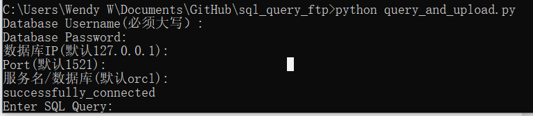

两个py file，分别是start_ftp.py和query_and_upload.py

user.ini是ftp的登陆用户&密码信息

test.csv是一个query后得到的csv

# 准备工作
## 配置用户名
打开user.init 将用户的home directory改成ftp path

## FTP
1. 知道ftp的ip和端口，本地默认为127.0.0.1 和2121
2. 配置user.ini，添加配置用户

## 数据库

1. 知道database的ip 和端口，本地默认问127.0.0.1 和 1521
2. database的类型，如果是Oracle可以直接使用；如果是Mysql需要修改一下。我还没有整理
3. 如果是Oracle数据库，需要进行cx_oracle插件的安装(用于python链接oracle数据库），在cmd：pip install cx-Oracle

# 开启FTP端口

cmd 中来到目录路径：
python start_ftp.py

# 开始进行query并上传

cmd中来到目录路径：
python query_and_upload.py

# 需要进行改进的地方
1. 目前只有Oracle DB
2. 没有提供一个sql数据库作为example。
